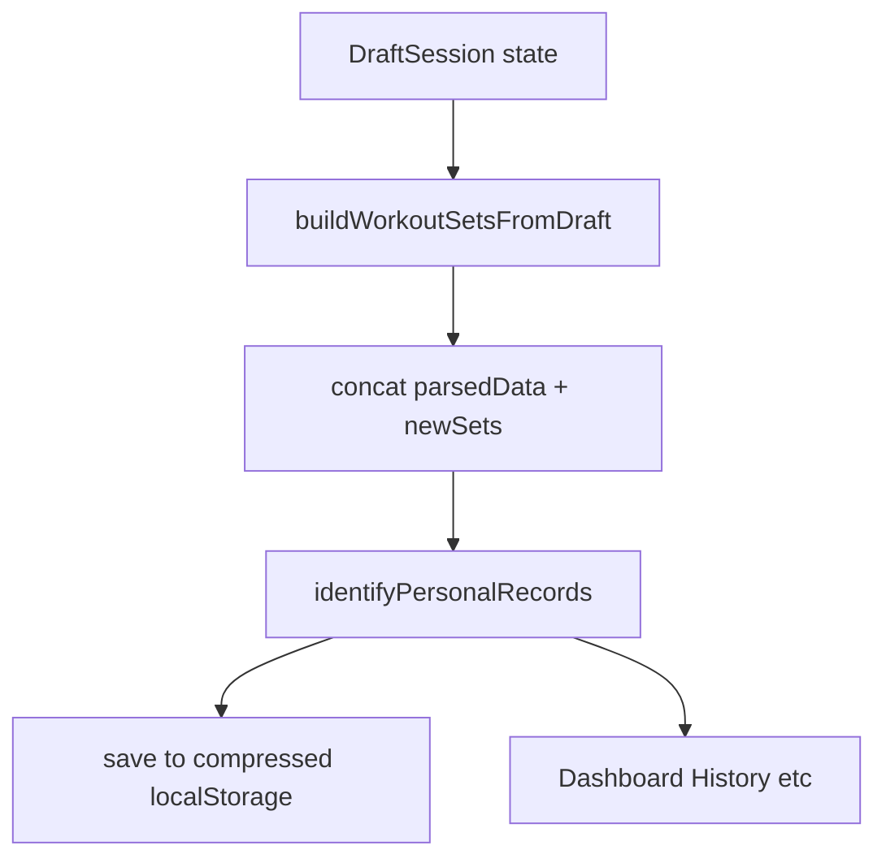

# MVP: локальный лог тренировок (детальный план)

## Цель и границы

- **В скоупе:** новая вкладка маршрута `/log`, UI черновика тренировки, сохранение в массив `[WorkoutSet](frontend/types.ts)`, пересчёт PR через `[identifyPersonalRecords](frontend/utils/analysis/core/analyticsPersonalRecords.ts)`, загрузка при старте с локального хранилища, таймер отдыха, подсказка «последний раз» по упражнению из текущего `parsedData`, выбор упражнения из библиотеки имён + свободный ввод.
- **Вне скоупа:** Firebase/Google, синк устройств, соцсети, суперсеты (можно заложить поле `superset_id` пустым), импорт CSV + одновременный ручной лог без явного правила слияния (см. раздел «Риски»).

## Продуктовое допущение (целевая аудитория MVP)

- **Основной сценарий:** пользователь ведёт журнал **только вручную** в этом приложении (источник `manual`). Не закладывать и не усложнять UX под типичного пользователя Hevy/Lyfta.
- **Импорт из других приложений** остаётся в кодовой базе как есть, но **не расширять** под него отдельную логику слияния с ручным журналом сверх минимального правила ниже — лишние ветки под «бывших пользователей Hevy» в MVP **не делать**.

## Термины

- **Черновик (draft):** несохранённая тренировка в памяти React (состояние экрана).
- **Снимок (persisted sets):** сериализованный массив `WorkoutSet[]` в `localStorage`.

---

## Архитектура данных

- **Вход в приложение:** существующий `[useStartupAutoLoad](frontend/app/startup/useStartupAutoLoad.ts)` + **новая ветка**: если выбран источник `manual` и в хранилище есть снимок — восстановить `parsedData` из снимка (см. шаги ниже).
- **Сохранение тренировки:** сгенерировать `WorkoutSet[]` из черновика → `const next = identifyPersonalRecords([...parsedData, ...newSets])` → `setParsedData(next)` → записать снимок → `saveDataSourceChoice('manual')` → `saveSetupComplete(true)` при необходимости.

## Правило: вкладка Log и сохранение (выбрано, не обсуждаем в коде)

- Вкладка **Log всегда видна** в навигации.
- Кнопка **«Сохранить тренировку»** активна и ведёт к сохранению **только если** `getDataSourceChoice()` — `**'manual'` или `null`**. Иначе — **блокировка сохранения** + короткое сообщение пользователю (тост или `alert` на MVP): смысл — сначала сбросить данные / импорт в настройках и перейти на ручной режим (тот же текст можно переиспользовать из существующего сценария очистки кэша).
- Реализация: в `LogWorkoutView` или колбэке из `App.tsx` проверять `dataSource` перед `handleSaveManualWorkout`; не плодить отдельные ветки под Hevy.

---

## Профиль: рост, вес тела, обхваты — нужно ли в MVP?

**В текущей аналитике LiftShift они не используются.** Расчёты PR, объёма, 1RM и трендов идут из полей подходов в `[WorkoutSet](frontend/types.ts)` (`weight_kg`, `reps`, даты). Признак «упражнение с собственным весом» определяется **эвристикой по названию упражнения** (см. `isBodyweightLike` в трендах), а не из антропометрии пользователя.

**Вывод для плана:**

- **Не включать** экран «Профиль с ростом/весом/замерами» в обязательный скоуп MVP лога тренировок — на графики и PR это не повлияет.
- **Опционально позже:** отдельная фича «тело» (замеры, вес тела для BMI/динамики, фото) — если понадобится продуктово; тогда понадобятся хранение в `localStorage`, формы и, при желании, отдельные графики — **вне текущего MVP-журнала**.

---

## Часть A — типы и чистые функции

### A1. Файл черновика (новый)

Создать, например, `[frontend/app/workoutLog/draftTypes.ts](frontend/app/workoutLog/draftTypes.ts)`:

- `DraftSet`: `{ localId: string; weightInput: number; reps: number; rpe: number | null; setType: 'warmup' | 'working' | string; notes: string }` (локальный `localId` = `crypto.randomUUID()` или счётчик).
- `DraftExercise`: `{ localId: string; name: string; sets: DraftSet[] }`.
- `DraftSession`: `{ startedAt: Date; title: string; exercises: DraftExercise[] }`.

### A2. Маппинг в `WorkoutSet` (новый)

Создать `[frontend/app/workoutLog/buildWorkoutSetsFromDraft.ts](frontend/app/workoutLog/buildWorkoutSetsFromDraft.ts)`:

- Импортировать `format` из `date-fns` и `[OUTPUT_DATE_FORMAT](frontend/utils/csv/csvParserUtils.ts)` (как в CSV-пайплайне).
- Для **каждого** подхода в **каждом** упражнении собрать один `WorkoutSet`:
  - `title` = `draft.title.trim()` или дефолт `"Workout"`.
  - `start_time` / `end_time`: для MVP задать **одинаковую** `startedAt` для всех сетов сессии ИЛИ смещение на секунды по порядку — **выбрать и задокументировать**. Рекомендация: одна `sessionStart: Date` на всю тренировку; `end_time` пустая строка или равна `start_time`.
  - `exercise_title` = имя упражнения.
  - `weight_kg`: конвертировать из UI с учётом `[WeightUnit](frontend/utils/storage/localStorage.ts)` пользователя (как `[toKg` в csvRowTransform](frontend/utils/csv/csvRowTransform.ts) — вынести общую функцию в `utils/units/weight.ts` **или** дублировать формулу один раз с комментарием «keep in sync with csvRowTransform»).
  - `reps`, `rpe`, `exercise_notes`, `set_type` из черновика.
  - `superset_id`: `''`.
  - `distance_km`: `0`, `duration_seconds`: `0` если не используются.
  - `description`: пустая строка или общие заметки сессии (опционально поле в `DraftSession`).
  - `parsedDate`: `new Date(sessionStart)` (одинаковая для всех сетов в MVP — допустимо).
- После массива вызвать экспортированные из `[csvRowTransform.ts](frontend/utils/csv/csvRowTransform.ts)` функции `[calculateSetIndices](frontend/utils/csv/csvRowTransform.ts)` и `[inferWorkoutTitles](frontend/utils/csv/csvRowTransform.ts)` на **сгенерированном** массиве (как после CSV), чтобы `set_index` / `title` были согласованы.

### A3. Нормализация типа подхода

Использовать существующую логику: посмотреть `[normalizeSetType](frontend/utils/csv/csvParserUtils.ts)` / использование в `transformRow` — в черновике ограничить UI двумя значениями и маппить в строки, которые ест аналитика.

---

## Часть B — персистенция

### B1. Расширить `[dataSourceStorage.ts](frontend/utils/storage/dataSourceStorage.ts)`

- Добавить в union `[DataSourceChoice](frontend/utils/storage/dataSourceStorage.ts)` значение `'manual'`.
- Добавить в `validDataSources` строку `'manual'`.

### B2. Новый модуль хранения снимка

Создать `[frontend/utils/storage/manualWorkoutStorage.ts](frontend/utils/storage/manualWorkoutStorage.ts)`:

- Использовать `[createCompressedStorageManager](frontend/utils/storage/createStorageManager.ts)` по аналогии с `[csvStorage](frontend/utils/storage/localStorage.ts)`.
- Ключ, например: `liftshift_manual_workout_sets_v1`.
- API: `saveManualWorkoutSets(sets: WorkoutSet[]): void` — перед сохранением **сериализация**: `JSON.stringify` массива, где для каждого сета `parsedDate` преобразовать в ISO-строку в отдельном поле **или** удалить `parsedDate` и при загрузке восстанавливать из `start_time` через существующий парсер дат (предпочтительно: хранить без `parsedDate`, при `get` парсить `start_time` в `Date` для каждого элемента).
- `getManualWorkoutSets(): WorkoutSet[] | null`
- `clearManualWorkoutSets(): void`

### B3. `[clearCacheAndRestart](frontend/app/state/clearCacheAndRestart.ts)`

- Вызвать `clearManualWorkoutSets()` (или экспорт из нового модуля) рядом с `clearCSVData()`.

---

## Часть C — загрузка при старте

### C1. `[useStartupAutoLoad.ts](frontend/app/startup/useStartupAutoLoad.ts)`

- В начале `useEffect` (после проверки `parsedData.length > 0`), если `getDataSourceChoice() === 'manual'` и `getManualWorkoutSets()` вернул массив длины > 0:
  - восстановить `parsedDate` на каждом сете при необходимости;
  - `setParsedData(identifyPersonalRecords(sets))`;
  - `setDataSource('manual')`;
  - `saveSetupComplete(true)` при необходимости;
  - `return` (не запускать Hevy/CSV ветку).
- Если `getSetupComplete()` false и нет manual данных — оставить текущее поведение.

### C2. Конфликт с CSV

- Если одновременно есть CSV и manual — **MVP:** приоритет за существующей логикой `storedChoice`; manual загружается **только** когда `dataSource === 'manual'`. Документировать в комментарии в `useStartupAutoLoad`.

---

## Часть D — маршрут и вкладка

### D1. `[tabs.ts](frontend/app/navigation/tabs.ts)`

- Добавить `LOG = 'log'`.
- В `getTabFromPathname`: если путь `/log` → `Tab.LOG`.
- В `getPathForTab`: для `Tab.LOG` → `'/log'`.

### D2. `[useAppNavigation.ts](frontend/hooks/app/useAppNavigation.ts)`

- Убедиться, что при смене `location.pathname` активный таб синхронизируется (уже есть паттерн) — добавить ветку для `/log` при необходимости.

### D3. `[AppTabContent.tsx](frontend/components/app/AppTabContent.tsx)`

- Импортировать ленивый компонент `LogWorkoutView` из нового файла.
- Добавить ветку `activeTab === Tab.LOG` с передачей пропсов (см. часть E).

### D4. `[AppHeader.tsx](frontend/components/app/AppHeader.tsx)`

- Добавить кнопку навигации на `Tab.LOG` (иконка + короткий лейбл, например «Log» / «Журнал» после i18n).
- Обновить сетку: сейчас `grid-cols-6` под 5 табов + календарь на мобиле — добавить седьмой таб потребует изменить классы (`grid-cols-7` или перенос строки) — **явно** подобрать классы, чтобы кнопки не ломались.

### D5. Prefetch (если есть)

- Проверить `[usePrefetchHeavyViews](frontend/app/navigation/usePrefetchHeavyViews.ts)` — при наличии списка чанков добавить prefetch для нового view.

---

## Часть E — UI экрана лога

Создать папку `[frontend/components/workoutLog/](frontend/components/workoutLog/)` (или `app/workoutLog/components/` — выбрать одно соглашение и держаться его).

### E1. Корневой компонент `LogWorkoutView.tsx`

Пропсы с `[App.tsx](frontend/App.tsx)` через `AppTabContent`:

- `parsedData`, `setParsedData` (или колбэк `onSaveWorkout(sets: WorkoutSet[])` из App — предпочтительно **колбэк из App**, чтобы не тащить `setState` через много слоёв неявно).
- `weightUnit`, `onWeightUnitChange` не обязательны на этом экране — брать `weightUnit` только для отображения/конвертации.
- Обязательно: `onSaveComplete` для сброса черновика.

Структура UI (сверху вниз):

1. Поле **название тренировки** (input, по умолчанию дата/время).
2. Список **упражнений** (каждое — карточка).
3. Кнопка **«Добавить упражнение»** — добавляет `DraftExercise` с одним пустым подходом.
4. Внутри упражнения: поле **название** + автодополнение (см. E3).
5. Таблица подходов: колонки **вес**, **повторы**, **RPE** (опционально number input), **тип** (select: разминка / рабочий), **заметки** (input), кнопка удалить подход.
6. Кнопка **«Добавить подход»** в упражнении.
7. Кнопка **«Удалить упражнение»**.
8. Блок **таймер отдыха** (см. часть F).
9. Кнопка **«Сохранить тренировку»** — валидирует (хотя бы одно упражнение с хотя бы одним подходом с весом/повторами по правилам), строит `WorkoutSet[]`, вызывает родительский `onSave`.

Состояние черновика: `useState<DraftSession | null>(null)` — при первом заходе инициализировать `startedAt: new Date()`, пустой список упражнений или одно упражнение с одним подходом (выбрать и зафиксировать).

### E2. «Предыдущие значения»

- Утилита `[getLastSetsForExercise(parsedData, exerciseName, limit)](frontend/app/workoutLog/lastSetsLookup.ts)`: отфильтровать по `exercise_title`, отсортировать по `parsedDate` / `start_time`, взять последние N подходов.
- Под полем упражнения показать строку текста: «Last: 80 kg × 8 @ RPE 8» если есть (форматировать с учётом `weightUnit` для отображения).

### E3. Автодополнение названий

- Загрузить `[getExerciseAssets](frontend/utils/data/exerciseAssets.ts)` один раз (`useEffect`), построить массив уникальных `name` из `Map`.
- Простой `<input list="...">` с `datalist` **или** кастомный выпадающий список с фильтрацией по вводу.
- Разрешить произвольную строку, не форсировать выбор из списка.

### E4. Валидация перед сохранением

- Хотя бы одно упражнение с непустым `name.trim()`.
- Хотя бы один подход с `reps > 0` или весом > 0 (уточнить: для MVP можно требовать оба > 0).
- При ошибке — показать `alert` или встроенный текст ошибки под кнопкой.

---

## Часть F — таймер отдыха

Создать `[frontend/app/workoutLog/useRestTimer.ts](frontend/app/workoutLog/useRestTimer.ts)`:

- Состояние: `secondsLeft`, `isRunning`, `targetSeconds`.
- API: `startRest(seconds: number)`, `stop()`, `tick` через `useEffect` + `setInterval` с очисткой.
- UI: кнопки пресетов `60 / 90 / 120` сек + кастомный ввод; отображение `MM:SS`; звук не добавлять в MVP (опционально позже).

---

## Часть G — связывание с `[App.tsx](frontend/App.tsx)`

1. Реализовать `handleSaveManualWorkout = (newSets: WorkoutSet[]) => { const merged = identifyPersonalRecords([...parsedData, ...newSets]); setParsedData(merged); setHasHydratedData(true); saveManualWorkoutSets(merged); saveDataSourceChoice('manual'); saveSetupComplete(true); }` — вызывать **только после** проверки `dataSource === 'manual' || dataSource === null` (иначе ранний return / сообщение пользователю).
2. Передать в `AppTabContent` колбэк, `dataSource` (или флаг `canSaveManual`) и пропсы для `LogWorkoutView`, чтобы UI дизейблил сохранение и показывал подсказку при запрете.
3. Убедиться, что `[useAppDerivedData](frontend/app/state)` и фильтры получают обновлённый `parsedData` без дополнительных изменений.

---

## Часть H — настройки и импорт (минимально)

- В `[UserPreferencesImportSection](frontend/components/modals/userPreferences/UserPreferencesImportSection.tsx)` или рядом: короткая строка «Ручной журнал: данные хранятся локально» (после i18n).
- Не добавлять Firebase.

---

## Часть I — тестирование вручную (чеклист)

1. Чистый профиль: открыть `/log`, создать тренировку, сохранить — данные на дашборде/истории.
2. Перезагрузка страницы — данные на месте.
3. Добавить вторую тренировку — PR и история обновляются.
4. «Clear cache» в приложении — manual данные очищаются вместе с остальным (после правки `clearCacheAndRestart`).
5. Мобильная ширина: табы не перекрывают друг друга.

---

## Риски и явные ограничения MVP

- **Смешивание CSV и manual:** для пользователя с уже выбранным импортом сохранение из Log заблокировано сообщением (см. раздел «Правило: вкладка Log»); полного автоматического merge в MVP нет.
- **Даты всех сетов одной сессии одинаковые** — приемлемо для MVP; улучшение: смещать `start_time` на +i секунд между подходами.
- **Размер localStorage** — при очень больших историях может понадобиться IndexedDB (вне MVP).

---

## Порядок реализации (строго по шагам для «тупой модели»)

1. `draftTypes.ts` + `buildWorkoutSetsFromDraft.ts` + unit-style проверка вручную в консоли (временный `console.log` в dev).
2. `manualWorkoutStorage.ts` + расширение `DataSourceChoice`.
3. `clearCacheAndRestart` + `useStartupAutoLoad` ветка `manual`.
4. `Tab.LOG` + маршрут + кнопка в `AppHeader` + ветка в `AppTabContent`.
5. `LogWorkoutView` статический UI без сохранения.
6. Подключить `onSave` к `App.tsx` и персистенции.
7. `useRestTimer` + встраивание в UI.
8. `lastSetsLookup` + отображение.
9. Автодополнение упражнений.
10. Полировка сетки `AppHeader`, ручной чеклист.

