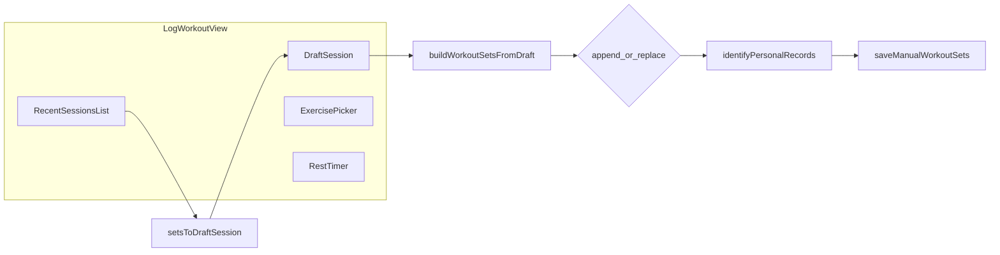

# План: «Тренировка», правки сессий, упражнения, подсказки, cursor rules

## Продуктовые ограничения (зафиксировано)

- **Редактирование прошлых тренировок** — только когда пользователь в **ручном режиме** (та же логика, что и «Сохранить»: `[canSaveManual](frontend/App.tsx)` / `getDataSourceChoice()` — `manual` или `null`). Сессии из импорта в этом MVP **не редактируем** (не показываем кнопку редактирования или показываем с пояснением «недоступно»).

## 1. Переименование и маршрут

- Текст вкладки и заголовка страницы: **«Тренировка»** (EN: e.g. **Workout**) через `[frontend/locales/en.ts](frontend/locales/en.ts)` / `[ru.ts](frontend/locales/ru.ts)` — ключи `nav.log` / `log.pageTitle` (или отдельные ключи `workout.*`), без обязательной смены URL: `**/log` оставить** для совместимости закладок.

## 2. Сетка страницы (3 колонки на desktop)

Файл: `[frontend/components/workoutLog/LogWorkoutView.tsx](frontend/components/workoutLog/LogWorkoutView.tsx)`.

- На `**lg+`**: CSS grid / flex с тремя зонами:
  - **Слева**: форма текущей тренировки (черновик) — существующий контент упражнений/подходов.
  - **По центру**: блок **таймера отдыха** (перенести из низа, использовать `[useRestTimer](frontend/app/workoutLog/useRestTimer.ts)` как сейчас).
  - **Справа**: зона **«Недавние тренировки»** — компактный список сессий из `parsedData` (группировка по `[getSessionKey](frontend/utils/date/dateKeys.ts)`, как в `[historySessions](frontend/components/historyView/utils/historySessions.ts)`) + действие **«Редактировать»** при `canSaveManual`.
- На `**sm/md`**: одна колонка, порядок: форма → таймер → список (или аккордеон), без горизонтального перегруза.

## 3. Редактирование прошлой сессии (manual only)

**Данные:** один массив `[WorkoutSet[]](frontend/types.ts)` в памяти + снимок в `[manualWorkoutStorage](frontend/utils/storage/manualWorkoutStorage.ts)`.

**Чистые функции (новые модули в `frontend/app/workoutLog/`):**

- `groupSetsIntoSessions(sets: WorkoutSet[])` → список `{ sessionKey, title, dateLabel, sets }`.
- `removeSession(sets, sessionKey)` → массив без сетов этой сессии.
- `setsToDraftSession(sets: WorkoutSet[])` / зеркало к `[buildWorkoutSetsFromDraft](frontend/app/workoutLog/buildWorkoutSetsFromDraft.ts)` — восстановить `DraftSession` из существующих сетов (важно: согласовать единицы веса с `weightUnit`).

**Поток UI:**

1. Пользователь нажимает «Редактировать» у сессии в правой колонке.
2. Черновик заполняется данными сессии; режим `editingSessionKey: string | null`.
3. «Сохранить» вызывает не append, а `**replaceSession`**: `next = identifyPersonalRecords([...removeSession(parsedData, key), ...newSetsFromDraft])`, затем `setParsedData`, `saveManualWorkoutSets` (как в `[App.tsx](frontend/App.tsx)` `handleSaveManualWorkout`), сброс режима редактирования.

**Колбэк из App:** расширить пропсы `LogWorkoutView`: например `onSaveWorkout(sets, mode: 'append' | 'replace', replaceSessionKey?: string)` или отдельный `onReplaceSession`, чтобы не дублировать `identifyPersonalRecords` внутри view.

## 4. Упрощённый выбор упражнения

Заменить «голый» `<input list>` на компонент **поиска с фильтрацией**:

- Источник данных: уже есть `[getExerciseAssets()](frontend/utils/data/exerciseAssets.ts)` (`name`, `primary_muscle`, `thumbnail`, …).
- **Поиск по подстроке** (debounce ~150ms) по `name` (регистронезависимо).
- **Фильтр по primary muscle** — выпадающий список уникальных значений из загруженной карты (или топ-N мышц).
- **Список подсказок**: строка с **миниатюрой** (если `thumbnail` — путь из CSV; URL собрать через существующий `[assetPath](frontend/constants)` / `BASE_URL`, как в остальном приложении).
- **Свободный ввод**: если пользователь ввёл название не из списка — сохранять как сейчас (произвольная строка).

Опционально второй шаг: **«Похожие по названию»** (первая страница результатов, кнопка «Показать ещё»), если список всё ещё длинный.

## 5. Подсказки по полям (UX)

Добавить в локали строки-пояснения и вывести их через **краткий текст под заголовком колонки** и/или `**title` / кнопка «?»** (доступность):

| Поле         | Смысл (кратко в UI)                                                |
| ------------ | ------------------------------------------------------------------ |
| Вес (kg/lbs) | Для упражнений с весом тела: **доп. отягощение**; 0 = только тело. |
| RPE          | Шкала усилия 1–10 (опционально).                                   |
| Тип          | Разминка vs рабочий — влияет на аналитику/фильтры warm-up.         |

Использовать `[useTranslation](frontend/i18n/i18n.ts)`; ключи вида `log.hintWeight`, `log.hintRpe`, `log.hintSetType`.

## 6. Cursor rules

Добавить правило в `[.cursor/rules/](.cursor/rules/)` (например `liftshift-workout-and-i18n.mdc`), чтобы зафиксировать для агента:

- Новые строки UI — только через **i18n** (`en` + `ru`).
- Крупные изменения экрана тренировки — сохранять **доступность** (labels, `aria-*`).
- Логика данных тренировок — **чистые функции** в `app/workoutLog/`, тонкий UI в `components/workoutLog/`.
- Редактирование сессий — только при **manual** и явной проверке `canSaveManual`.

(Формат — по [create-rule skill](C:\Users\Ivan_.cursor\skills-cursor\create-rule\SKILL.md): frontmatter `description`, `globs` на `frontend/components/workoutLog/`**, `frontend/app/workoutLog/`**, `frontend/locales/**`.)

## 7. Порядок внедрения (рекомендуемый)

1. Локали + переименование «Тренировка» + подсказки по полям (быстрый выигрыш).
2. Верстка 3 колонок + перенос таймера.
3. Компонент выбора упражнения (поиск + мышца + превью).
4. Утилиты группировки/удаления сессии + режим редактирования + колбэк в `App.tsx`.
5. Cursor rule файл.

## Риски

- **Длина списка** даже с фильтром — контролировать через debounce + лимит отображаемых строк (например 30) + скролл.
- **Обратный маппинг** `WorkoutSet[]` → `DraftSession` должен совпадать с тем, как `[buildWorkoutSetsFromDraft](frontend/app/workoutLog/buildWorkoutSetsFromDraft.ts)` задаёт `start_time` / индексы — иначе «редактирование» разъедет сессии; потребуется одна согласованная стратегия ключа сессии.

